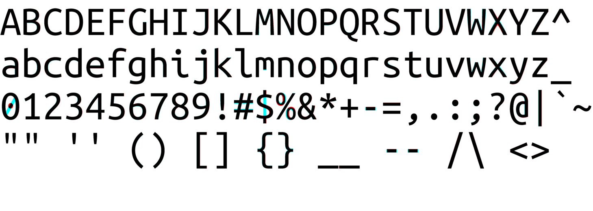
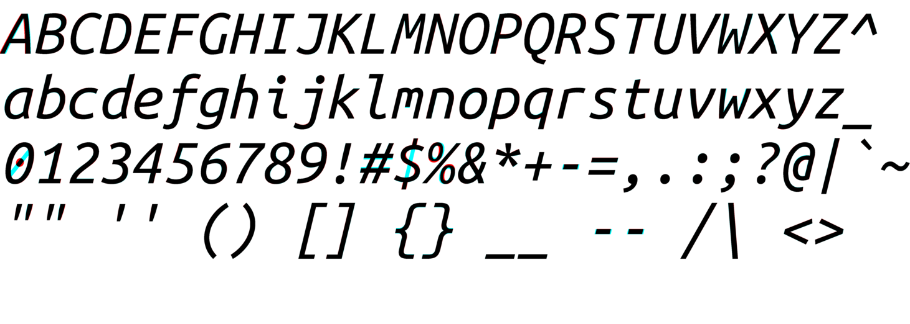
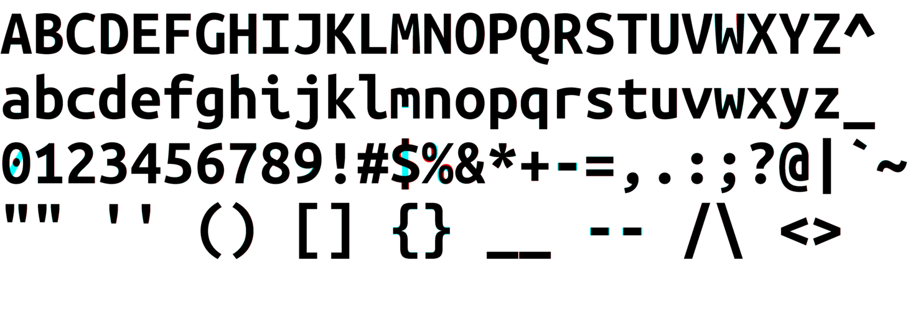
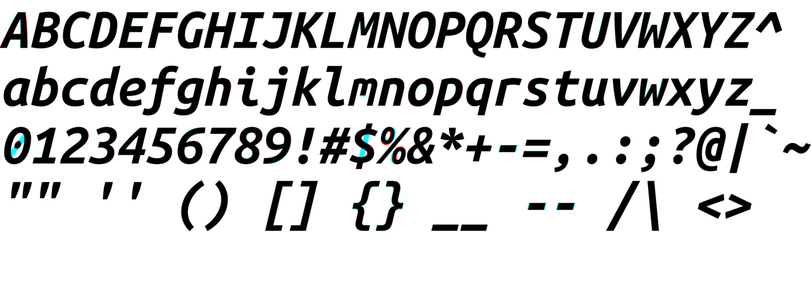

# Jambo Mono Fonts

Slightly tweaked Ubuntu Mono fonts. They are merely intended as fixes to
several slight flaws in the original and not as a new font project.

## Alterations

1. `W` and `w` - thickened to make character height appear more uniform across
   lines.
2. `-` - lengthened hyphen.
3. `*A*` - thickened and shifted left leg of italic.
4. `%` - rounder circles.
5. `$` - vertical line through the center.
6. `0` - diagonal line across the middle instead of a dot.
7. `m` - thickened and slightly lengthened middle.
8. `{` and `}` - thickened middle nub and brace ends.
9. OpenType font variant. (Ubuntu Mono is only available as TTF.)

The changes are very small.

Comparison with original below ('red' is original Ubuntu, 'cyan' is Jambo):









## Available styles

1. JamboMono-{R,RI,B,BI}.ttf - TrueType variants
2. JamboMono-{R,RI,B,BI}.otf - OpenType font with hinting metadata

## Installation

The `install` script will install the font in either
`${HOME}/.local/share/fonts` or `/usr/local/share/fonts`, depending of the user
is root or not. Simply run:
```bash
./install
```
