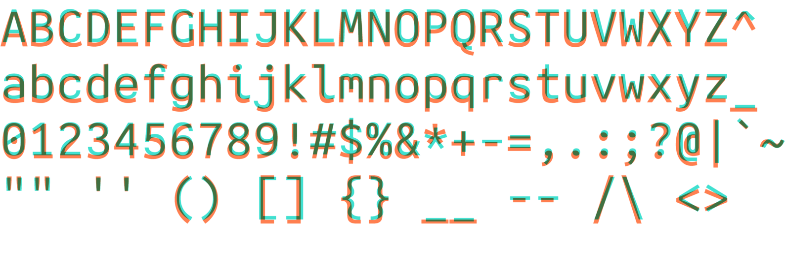
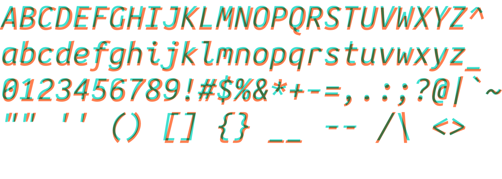
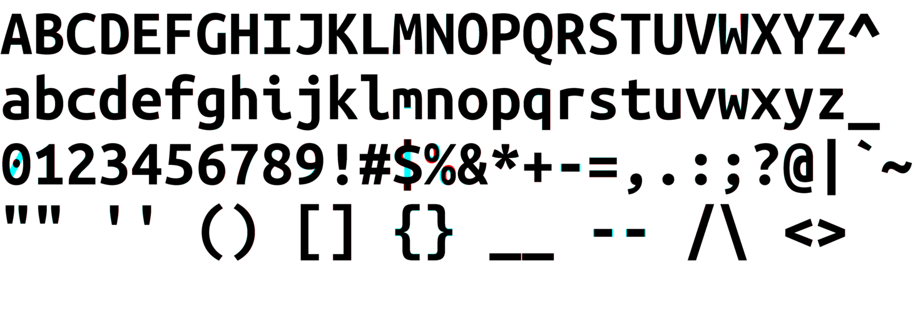
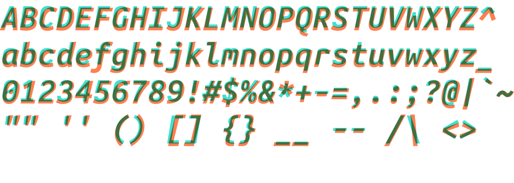

# Jambo Mono Fonts

[Iosevka](https://github.com/be5invis/Iosevka)-derived fonts intended to closely
match the Ubuntu Mono fonts, including
[Nerd fonts](https://github.com/ryanoasis/nerd-fonts) patched variants.

Built with Iosevka 30.3.0 and Nerd Fonts 3.2.1.

**NOTE:** To minimize repository size, the compiled fonts are continually
rebased to HEAD. This means that 1) the tree only contains build files for older
variants instead of the actual font files, and 2) any updates to the repository
will cause merge conflicts in already-cloned repositories.

For 1), use the provided to configuration files to compile previous variants,
and for 2), simply force-pull/merge updates or re-clone the repository.

## Alterations

1. `$` - vertical line through the center.
2. `¢` - vertical line through the center.
3. `0` - diagonal line across the middle instead of a dot.
4. `9` and `6` - curl the bottom/top (helps with hinting at lower sizes).
5. `{` and `}` - make curlier.
6. `8` - make crossing point in middle narrower to better distinguish the glyph
   from `0`.

See below for a comparison between Jambo ('turquoise') and the original Ubuntu
('coral'):









## Installation

The `install` script will install the font in either
`${HOME}/.local/share/fonts` or `/usr/local/share/fonts`, depending on whether
the user is root or not. Run:

```bash
./install
```

To install Nerd-patched and/or unhinted variants, use the `-n` and `-u` flags,
respectively.

## Usage

The fonts use the family name `Jambo Mono`, with each file corresponding to
`Regular`, `Bold`, `Italic`, and `Bold Italic` styles. Should these fonts be too
thin, use `Medium` instead of regular and `Heavy` instead of `Bold`.

For the Nerd-patched fonts, the family name is instead `JamboMono Nerd Font`.

## Building

### Manual

To build the fonts, use or review the `./build` script at the root of the
repository. The script will warn about missing dependencies first.

### Container

Avoid installing the dependencies by using the Containerfile to build a
Debian-based image to run the build script instead.

```sh
podman build -t jambo-build .
```

When running the build image, create a directory and mount it as a volume:

```sh
podman run --rm --network host -v </abs/path/to/dest/>:/home/dest:Z localhost/jambo-build:latest
```

The `</abs/path/to/dest/>` is the _absolute path_ to the destination directory
for the compiled font tiles.
