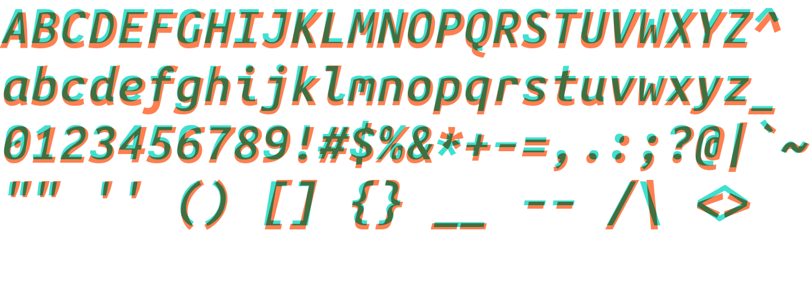

# Jambo Mono Fonts

[Iosevka](https://github.com/be5invis/Iosevka)-derived fonts intended to
closely match the Ubuntu Mono fonts, including [Nerd
fonts](https://github.com/ryanoasis/nerd-fonts) patched variants.

Built with Iosevka 21.0.0 and Nerd Fonts 2.3.3.

**NOTE:** To minimize file size, the compiled fonts are continually rebased to
HEAD. This means that 1) the tree does not contain older variants and 2) any
updates to the repository will trigger merge conflicts.

For 1), use the provided to configuration files to compile previous variants,
and for 2), simply force-pull/merge updates.

## Alterations

1. `$` - vertical line through the center.
2. `¢` - vertical line through the center.
3. `0` - diagonal line across the middle instead of a dot.
4. `9` and `6` - curl the bottom/top (helps with hinting at lower sizes).
5. `{` and `}` - make curlier.
6. `8` - make crossing point in middle narrower to better distinguish the glyph
   from `0`.

See below for a comparison between Jambo ('turquoise') and the original Ubuntu
('coral'):




## Installation

The `install` script will install the font in either
`${HOME}/.local/share/fonts` or `/usr/local/share/fonts`, depending on whether
the user is root or not. Run:
```bash
./install
```

## Usage

The fonts use the family name `Jambo Mono`, with each file corresponding to
`Regular`, `Bold`, `Italic`, and `Bold Italic` styles. Should these fonts be
too thin, use `Medium` instead of regular and `Heavy` instead of `Bold`.

For the Nerd-patched fonts, append `Nerd Font Complete` to the family names
described above.

## Building

### Iosevka

The configuration file used to generate all the fonts is available in `src/`.

The `jambo-mono` build plan corresponds to the TTF files in this repository,
and the `jambo-mono-tall` rules will build a variant with slightly taller
capitals and numerals at larger font sizes.

To build the font files, first install TTF autohinter.

Then, run:
```bash
git clone --depth 1 https://github.com/be5invis/Iosevka.git iosevka
cd iosevka
npm i
npm run build -- contents::jambo-mono
```

Use `contets::jambo-mono-tall` for the tall variant, and `--jCmd=<n>` to run
`n` threads in parallel. The files will be found in `dist/`. To apply the Nerd
Font patch set, look at its online documentation.

### Nerd patching

To patch the nerd font set, first download the font-patcher script from Nerd
fonts and install fontforge. Then, in the `dist/` directory in the Iosevka
repository, run:
```sh
DIRS=(jambo-mono/ttf jambo-mono/ttf-unhinted)
for DIR in "${DIRS[@]}"; do
  for FONT in "${DIR}"/*.ttf; do
    fontforge -script <path/to/font-patcher> \
      -q -l -c --careful -out "${DIR}-nerd" "${FONT}"
  done
done
```

Be sure to substitute `<path/to/font-patcher>` with the relative path to the
Nerd `font-patcher` script.
