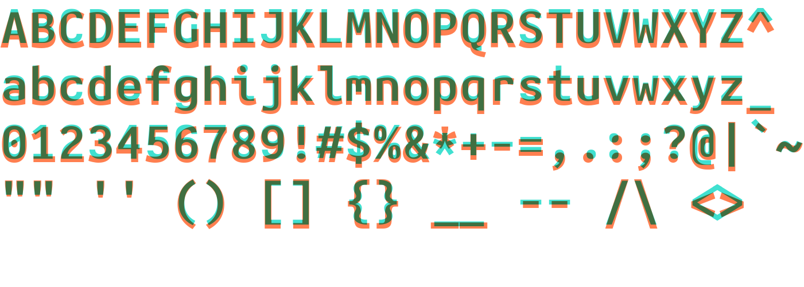

# Jambo Mono Fonts

Iosevka-derived fonts intended to closely match the Ubuntu Mono fonts,
including [Nerd fonts](https://github.com/ryanoasis/nerd-fonts) patched
variants.

## Alterations

1. `$` - vertical line through the center.
2. `¢` - vertical line through the center.
3. `0` - diagonal line across the middle instead of a dot.
4. `9` and `6` - curl the bottom/top (helps with hinting at lower sizes).
5. `{` and `}` - make curlier.

See below for a comparison between Jambo ('turquoise') and the original Ubuntu
('coral'):





Patched against Nerd fonts v2.3.3 (03/01/2023).

## Installation

The `install` script will install the font in either
`${HOME}/.local/share/fonts` or `/usr/local/share/fonts`, depending on whether
the user is root or not. Run:
```bash
./install
```

## Usage

The non-Nerd Jambo fonts use the family name `Jambo Mono`, with each file
corresponding to `Regular`, `Bold`, `Italic`, and `Bold Italic` styles.

The Nerd-patched versions are instead named `Jambo Mono Nerd Font Complete`.
This is the default name set by the`font-patcher` script found in the [Nerd
fonts repository](https://github.com/ryanoasis/nerd-fonts).


## Building

The config file used to generate all the fonts is available in `src/`. The
`jambo-mono` build plan corresponds to the TTF files in this repository, and
the `jambo-mono-tall` rules will build a variant with slightly taller capitals
and numerals at larger font sizes.
