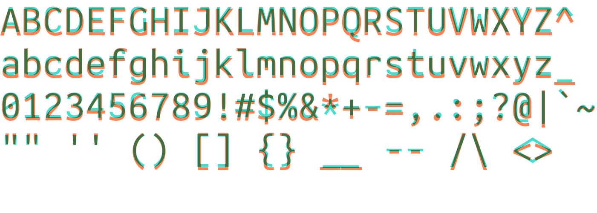
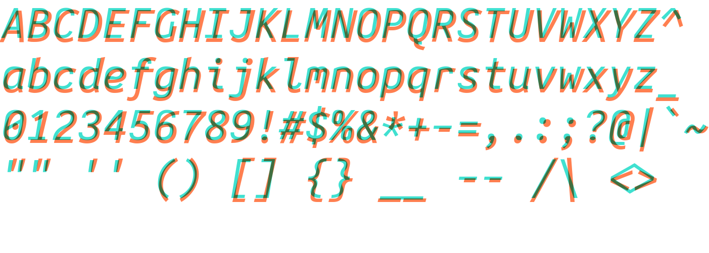

# Jambo Mono Fonts

Slightly tweaked Ubuntu Mono fonts patched with the [Nerd
fonts](https://github.com/ryanoasis/nerd-fonts) icon set. They are merely
intended as fixes to several slight flaws in the original and not as a new font
project.

## Alterations

1. `W` and `w` - thickened to make character height appear more uniform across
   lines.
2. `-` - lengthened hyphen.
3. `*A*` - thickened and shifted left leg of italic.
4. `%` - rounder circles.
5. `$` - vertical line through the center.
6. `0` - diagonal line across the middle instead of a dot.
7. `m` - thickened and slightly lengthened middle.
8. `{` and `}` - thickened middle nub and brace ends.
9. OpenType font variant. (Ubuntu Mono is only available as TTF.)

The changes are not large. See below for a comparison between Jambo ('cyan')
and the original Ubuntu ('red'):






## Available styles

1. `JamboMono-{R,RI,B,BI}.ttf` - TrueType variants (no Nerd symbolic fonts)
2. `JamboMono-{R,RI,B,BI}.otf` - OpenType font with hinting metadata (no Nerd symbolic fonts)
3. `JamboMonoNerd-{R,RI,B,BI}.ttf` - TrueType with Nerd symbolic fonts
4. `JamboMonoNerd-{R,RI,B,BI}.otf` - OpenType with Nerd symbolic fonts
5. `JamboMonoNerd-{R,RI,B,BI}-WC.ttf` - TrueType with Nerd symbolic fonts (Windows-compatible)
6. `JamboMonoNerd-{R,RI,B,BI}-WC.otf` - OpenType with Nerd symbolic fonts (Windows-compatible)

Patched against Nerd fonts v2.3.3 (01/24/2023).

## Installation

The `install` script will install the font in either
`${HOME}/.local/share/fonts` or `/usr/local/share/fonts`, depending on whether
the user is root or not. Run:
```bash
./install
```

## Usage

The non-Nerd Jambo fonts use the family name `Jambo Mono`, with each file
corresponding to `Regular`, `Bold`, `Italic`, and `Bold Italic` styles.

The Nerd-patched versions are instead named `JamboMono Nerd Font`. This is the
default name set by the`font-patcher` script found in the [Nerd fonts
repository](https://github.com/ryanoasis/nerd-fonts).


## Building

All changes were made using Font Lab 8, including the hinting. The \*.vfc files
used to generate the OTF and TTF files are available in the 'src/' directory.

The source files for the original Ubuntu Mono fonts are available
[here](https://assets.ubuntu.com/v1/0f5898c1-ubuntu-font-family-sources_0.83.orig.tar.gz).
